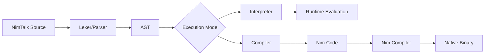

# NimTalk

A modern Smalltalk dialect that plays nice with modern tooling, integrates seamlessly with the Nim ecosystem, and supports both AST interpretation and compilation to Nim code.

## Overview

NimTalk is a prototype-based Smalltalk dialect designed for the modern era. It combines the elegance and simplicity of Smalltalk's object model with the performance and tooling of Nim. NimTalk can be both interpreted for rapid development and compiled to efficient Nim code for production deployment.

## Goals

1. **Modern Smalltalk**: Bring Smalltalk's clean, message-passing object model to modern development workflows
2. **Nim Ecosystem Integration**: Leverage Nim's performance, metaprogramming, and extensive library ecosystem
3. **Dual Execution Model**: Support both AST interpretation (for REPL and rapid prototyping) and compilation to Nim (for production)
4. **Modern Tooling**: Work seamlessly with version control, editors, build systems, and other modern development tools
5. **Practical Persistence**: Integrate with BitBarrel for first-class persistent objects (inspired by Gemstone and original OODBs)

## Features

### Language
- **Prototype-based object system** with dynamic inheritance
- **Message-passing semantics** with unary, binary, and keyword messages
- **Block closures** with lexical scoping
- **Simple, consistent syntax** inspired by Smalltalk
- **Dynamic typing** with optional type annotations via Nim integration

### Execution Models
- **AST Interpreter**: Full Smalltalk semantics with dynamic evaluation
- **Nim Compiler**: Compile NimTalk code to efficient Nim procedures
- **REPL**: Interactive development with immediate feedback

### Nim Integration
- **FFI Support**: Call Nim code directly from NimTalk
- **Type Marshaling**: Seamless conversion between NimTalk objects and Nim types
- **Module System**: Import and use Nim modules as libraries
- **Performance**: Leverage Nim's native compilation for critical code paths

### Tooling
- **Command-line REPL** (`ntalk`) for interactive development
- **Build System**: Integration with Nimble and nims build scripts
- **Editor Support**: Syntax highlighting and tooling for modern editors
- **Testing Framework**: Integrated test runner with Nim's unittest

## Getting Started

### Installation

```bash
# Clone the repository
git clone https://github.com/yourusername/nimtalk.git
cd nimtalk

# Build the REPL
nimble build

# Install the binary (optional)
nimble install
```

### Quick Example

Create a file `hello.nt`:
```smalltalk
#!/usr/bin/env ntalk

# Create a calculator object
Calculator := Object derive

# Add the two numbers as properties
Calculator at: 'x' put: 3
Calculator at: 'y' put: 4

# Get the result
Calculator at: 'x'
```

Run it:
```bash
ntalk hello.nt
# or compile it
ntalk --compile hello.nt
```

### REPL Usage

```bash
$ ntalk
NimTalk v0.1.0
> obj := Object derive
> obj at: 'value' put: 42
> obj at: 'value'
42
```

## Architecture

### AST Interpreter
The interpreter provides full dynamic evaluation:
- **Lexer**: Tokenizes NimTalk source code
- **Parser**: Builds AST from tokens
- **Evaluator**: Executes AST with prototype object system
- **Object Model**: Dynamic objects with property bags and prototype chains

### Nim Compiler
The compiler transforms NimTalk to Nim code:
- **Method Compilation**: Convert Smalltalk methods to Nim procedures
- **FFI Bridge**: Generate marshaling code for Nim type integration
- **Optimization**: Leverage Nim's optimizer for performance-critical code

### Dual-Mode Execution


## Language Syntax

### Basic Expressions
```smalltalk
# Literals
42
'hello world'
true
false

# Assignment
x := 42
obj := Object derive

# Message sends
Object clone
obj at: 'key'
obj at: 'key' put: 'value'
3 + 4
```

### Objects and Prototypes
```smalltalk
# Create prototype
Person := Object derive
Person at: 'name' put: 'Anonymous'
Person at: 'greet' put: [ 'Hello, ' + self at: 'name' ]

# Create instance
alice := Person derive
alice at: 'name' put: 'Alice'

# Send message
alice greet  # Returns 'Hello, Alice'
```

### Blocks and Control Flow
```smalltalk
# Block with parameter
[ :x | x * 2 ]

# Conditional
(x > 0) ifTrue: [ 'positive' ] ifFalse: [ 'negative' ]

# Iteration
numbers do: [ :each | each print ]
```

## Nim Integration

### Calling Nim Code
```smalltalk
# Import Nim module
nimMath := Nim import: 'math'

# Call Nim function
result := nimMath sqrt: 25.0
```

### Type Conversion
```smalltalk
# NimTalk to Nim
nimInt := 42 asNim: int
nimString := 'hello' asNim: string

# Nim to NimTalk
talkObj := fromNim: nimObject
```

## Future Directions

### BitBarrel Integration
Planning to integrate [BitBarrel](../bitbarrel/) as a core persistence layer:
- **First-class barrels** as language objects
- **Transparent persistence** for NimTalk objects
- **High-performance storage** with O(1) reads
- **Crash recovery** and background compaction

This would provide a powerful built-in persistence model similar to Gemstone and original OODBs.

### Language Features
- **Modules and namespaces**
- **Optional static type checking**
- **Concurrency model** (using Nim's threading)
- **Standard library** of collections and utilities

### Tooling
- **Language server** for IDE integration
- **Debugger** with Smalltalk-style inspectors
- **Package manager** for NimTalk libraries
- **Web interface** for remote development

## Why NimTalk?

### For Smalltalk Developers
- Familiar semantics with modern tooling
- Access to Nim's performance and ecosystem
- Production-ready compilation targets
- Integration with existing C/C++ libraries via Nim

### For Nim Developers
- Dynamic, interactive development experience
- Prototype-based object model
- REPL for exploration and debugging
- Gradual typing: start dynamic, add types as needed

### For Everyone
- **Simple**: Clean, consistent syntax
- **Practical**: Works with existing tools and workflows
- **Fast**: Native compilation via Nim backend
- **Integrable**: Bridges dynamic and static worlds

## Development Status

**Current**: Early prototype with basic interpreter and compiler skeleton
- ✅ Lexer and parser
- ✅ Prototype object system
- ✅ AST interpreter core
- ✅ Basic REPL
- ✅ Compiler infrastructure
- ✅ Test suite

**In Progress**:
- FFI integration with Nim
- Complete method compilation
- Standard library objects

**Planned**:
- BitBarrel persistence integration
- Performance optimization
- Enhanced tooling

## Contributing

NimTalk is an open project welcoming contributions. Areas of particular interest:
- Language design and semantics
- Nim integration features
- Performance optimization
- Tooling and editor support
- Documentation and examples

See [CONTRIBUTING.md](CONTRIBUTING.md) for development guidelines.

## License

MIT License - see [LICENSE](LICENSE) file for details.

## Acknowledgments

Inspired by:
- Smalltalk and its many implementations
- Nim's pragmatic meta-programming
- Gemstone's persistent object model
- Modern scripting languages and their tooling

---

*NimTalk: Smalltalk semantics, Nim performance, modern tooling.*